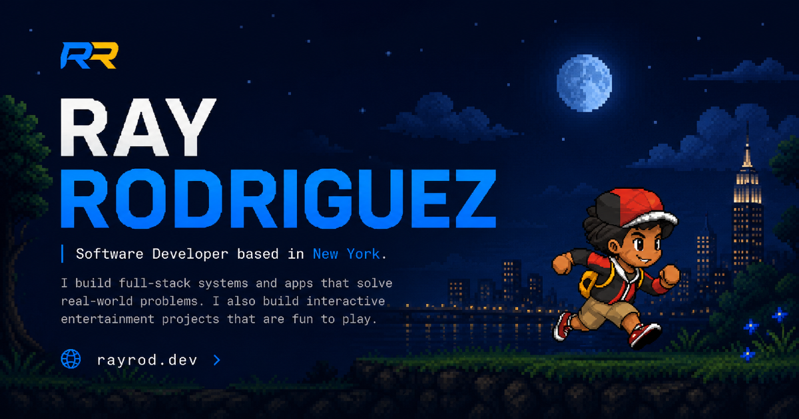

# Ray Rodriguez Portfolio

[View the live portfolio](https://rayrod.dev/)



A responsive, single-page portfolio built to present my software engineering experience, selected work, technical stack, and contact information. The site combines a restrained graphite interface with custom pixel-art details and focused interaction design.

## Highlights

- Responsive hero with a timed typing and content-reveal sequence
- Section-aware navigation with desktop and mobile experiences
- Professional experience and selected project case studies
- Categorized technology stack and current focus areas
- Direct contact, profile, and resume links
- Custom trainer sprite assets and small animated details
- Open Graph, social sharing, and search crawler metadata
- Accessible anchor navigation with reduced-motion support

## Tech Stack

- React 19
- TypeScript
- Vite
- Tailwind CSS
- React Icons
- Section-scoped CSS

## Site Sections

- **Hero**: introduction, primary actions, profile links, and trainer artwork
- **Status**: current availability, core stack, and areas of focus
- **About**: professional background, experience, and development interests
- **Work**: selected client, company, and personal projects
- **Stack**: tools and technologies organized by engineering layer
- **Contact**: email, LinkedIn, GitHub, resume, and back-to-top navigation

The portfolio intentionally uses section anchors instead of client-side routing.

## Repository Structure

```text
personal-site/
  README.md
  ray-portfolio/
    public/
      sprites/trainer/   Transparent trainer animation frames
      reference/         Source and reference visual assets
      *.png, *.svg       Branding and presentation assets
      *.pdf              Resume
    src/
      components/
        illustrations/   Reusable artwork and visual components
        layout/          Navbar, sidebar, and shared layout components
      data/              Profile links, project content, and stack data
      sections/          Main page sections
      styles/
        components/      Component-specific styles
        sections/        Section-specific styles
      App.tsx            Page composition
      index.css          Theme variables, imports, and global styles
```

## Local Development

From the repository root:

```bash
cd ray-portfolio
npm install
npm run dev
```

Vite will print the local development URL in the terminal.

## Available Scripts

```bash
npm run dev      # Start the development server
npm run build    # Type-check and create a production build
npm run lint     # Run ESLint
npm run preview  # Preview the production build locally
```

Run these commands from the `ray-portfolio` directory.

## Design and Architecture

The visual system uses a neutral graphite foundation, electric blue accents, and restrained yellow highlights. Theme values and shared behavior live in CSS variables and named component classes, while larger sections maintain their own stylesheets.

Content that changes independently from presentation, including project entries, stack categories, and profile URLs, is kept in typed data modules. Page-level React components remain small and focused on composition and interaction.

## Deployment

The production site is deployed through Vercel at [rayrod.dev](https://rayrod.dev/). Updates pushed to the connected production branch are built and deployed automatically by Vercel.

## Asset Usage

The branding, resume, artwork, and trainer sprite assets in this repository are personal portfolio materials. The source is public for technical review, but those assets are not licensed for reuse or redistribution.
